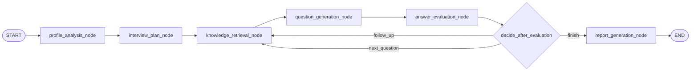

# Backend Workflows

## Knowledge Base Indexing

```mermaid
flowchart TD
    A[POST /api/documents/upload] --> B[Save original file]
    B --> C[Create Document row]
    C --> D[POST /api/documents/{id}/parse]
    D --> E[Extract text]
    E --> F{Parse success?}
    F -- No --> G[Mark document failed]
    F -- Yes --> H[Clean text]
    H --> I[Split chunks]
    I --> J[Generate metadata]
    J --> K[Create embeddings]
    K --> L[Upsert JSON vector store]
    L --> M[Replace DocumentChunk rows]
    M --> N[Mark document completed]
```

## Interview Runtime

```mermaid
flowchart TD
    START([POST /api/interviews]) --> A[profile_analysis_node]
    A --> B[interview_plan_node]
    B --> C[knowledge_retrieval_node]
    C --> D[question_generation_node]
    D --> WAIT[Return question and wait for user]
    WAIT --> ANSWER[POST /api/interviews/{id}/answer]
    ANSWER --> E[answer_evaluation_node]
    E --> F{Need follow-up?}
    F -- Yes --> G[Increment follow_up_count]
    G --> C
    F -- No --> H{Reached max questions?}
    H -- No --> I[Move to next question]
    I --> C
    H -- Yes --> J[report_generation_node]
    J --> K[Save InterviewReport]
    K --> END([completed])
```

## LangGraph Topology

The code builds a `StateGraph` with these logical nodes:



The current REST runtime pauses at the API boundary after `question_generation_node`.
This keeps the first implementation simple for Web Chat integration while preserving
the same node boundaries for a future direct `interrupt` / `Command(resume=...)`
LangGraph execution model.
